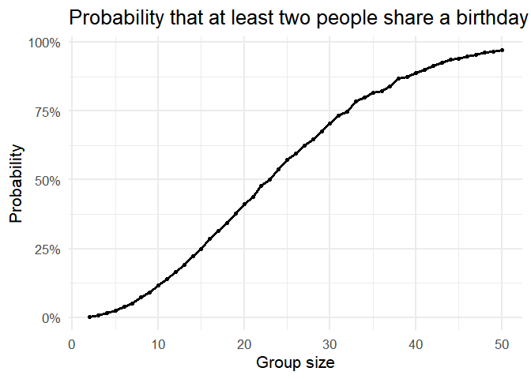
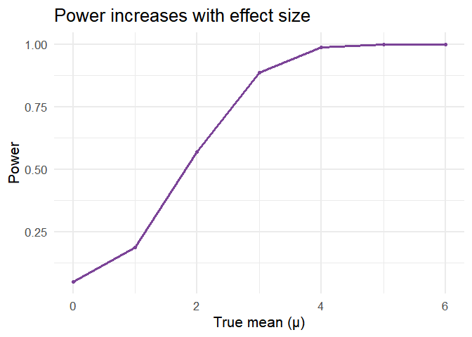
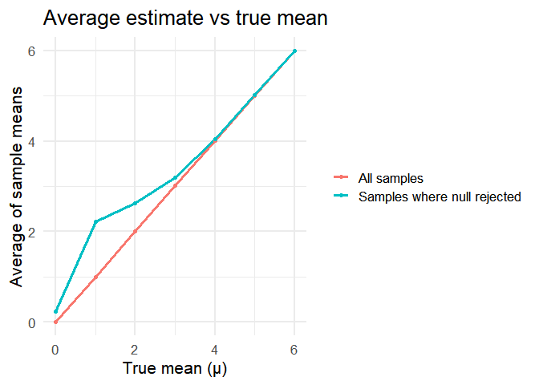

p8105_hw5_jj3564
================
Kate
2025-11-14

## problem 1

``` r
# Define a function that checks if at least two people share a birthday
dup_bday <- function(n) {
  # Randomly assign birthdays (1–365) to n people, allowing duplicates
  bdays <- sample(1:365, n, replace = TRUE)
  # Return TRUE if there is any duplicate birthday, FALSE otherwise
  any(duplicated(bdays))
}

# Define a function to estimate the probability of shared birthdays
prob_bday <- function(n, sims = 1e4) {
  # Repeat the birthday simulation 'sims' times
  # Each run returns TRUE/FALSE; taking the mean gives the estimated probability
  mean(replicate(sims, dup_bday(n)))
}

# Create a tibble with group sizes from 2 to 50
# For each group size, compute the probability using 'prob_bday'
results <- tibble(
  n = 2:50,
  prob = map_dbl(n, prob_bday)
)

# Plot the probability curve using ggplot2

ggplot(results, aes(x = n, y = prob)) +
  geom_line(linewidth = 1.1) +  # Draw line
  geom_point() +                  # Add data points
  scale_y_continuous(labels = scales::percent) +   # Convert y-axis to %
  labs(
    title = "Probability that at least two people share a birthday",
    x = "Group size",
    y = "Probability"
  )
```

<!-- -->

``` r
# Result Interpretation:
# 
# The resulting plot visualizes the "Birthday Paradox" — 
# how the probability that at least two people share the same birthday 
# increases with group size.
# 
# The curve starts near 0% when only 2–5 people are in the group, 
# but rises rapidly as the group becomes larger. 
# Around 23 people, the probability exceeds 50%,
# Around 50 people, the probablity is next to 100%
# showing that even in a relatively small group, 
# there is a surprisingly high chance that two people share a birthday.
# 
# This counterintuitive result illustrates how random combinations 
# grow quickly with group size, and give us an intution that though 365 days, only 50 
#   people can nearly guarantee a repetition
```

\##Problem 2

``` r
# Design parameters
n <- 30
sigma <- 5
mus <- 0:6
n_sim <- 5000

# Run simulations for each true mean
sim_df <- tibble(mu = mus) %>%
  mutate(
    res = map(mu, ~ {
      # For each mu, run 5000 simulated t-tests
      replicate(n_sim, {
        x <- rnorm(n, mean = .x, sd = sigma)
        tidy(t.test(x, mu = 0)) %>%
          select(estimate, p.value)
      }, simplify = FALSE) %>%
        bind_rows()
    })
  ) %>%
  unnest(res)

# Compute power and mean estimates
power_df <- sim_df %>%
  group_by(mu) %>%
  summarise(
    power = mean(p.value < 0.05),
    mean_all = mean(estimate),
    mean_sig = mean(estimate[p.value < 0.05]),
    .groups = "drop"
  )

# ---- Plot 1: Power vs Effect Size ----
ggplot(power_df, aes(mu, power)) +
  geom_line(color = "#7B4397", linewidth = 1.1) +
  geom_point(color = "#7B4397") +
  labs(
    title = "Power increases with effect size",
    x = "True mean (μ)",
    y = "Power"
  )
```

<!-- -->

``` r
# ---- Plot 2: Average Estimate vs True Mean ----
power_df %>%
  pivot_longer(c(mean_all, mean_sig),
               names_to = "type", values_to = "mean_est") %>%
  mutate(type = recode(type,
                       mean_all = "All samples",
                       mean_sig = "Samples where null rejected")) %>%
  ggplot(aes(mu, mean_est, color = type)) +
  geom_line(linewidth = 1.1) +
  geom_point() +
  labs(
    title = "Average estimate vs true mean",
    x = "True mean (μ)",
    y = "Average of sample means",
    color = NULL
  )
```

<!-- -->
